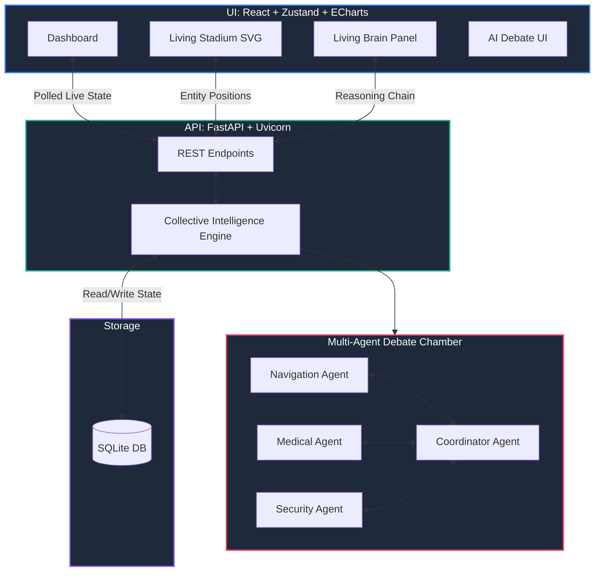

<div align="center">

# 🧠 StadiumVerse Intelligence OS
**The Living Brain for FIFA World Cup 2026 Stadium Command Centers**

*Built for Hackathon Challenge 4: Smart Stadiums & Tournament Operations*

[](https://stadiumverse-intelligence-os.vercel.app)
[](https://stadiumverse-intelligence-os-api.onrender.com)
[](https://github.com/harichopper/stadiumverse-intelligence-os)
<br>
[](https://github.com/harichopper/stadiumverse-intelligence-os)
[](https://python.org)
[](https://typescriptlang.org)

</div>

---

## 🎯 The Vision: Challenge 4 Alignment

StadiumVerse Intelligence OS is an AI-powered platform that transforms a FIFA World Cup 2026 stadium into a **self-aware, proactive command center**. It solves the core challenge problem: *How do you safely and efficiently manage 87,000+ fans, 140+ volunteers, and real-time stadium operations using AI?*

> **"What if the stadium itself could think, debate, predict, and act?"**

The system maps perfectly to the **Smart Stadiums & Tournament Operations** criteria:
- 🏟️ **Crowd Management** — Real-time gate density monitoring and congestion prediction to minimize **wait times**.
- 👥 **Fan Experience** — A comprehensive digital twin network modeling individual AI models for every fan, volunteer, and zone.
- 🧠 **Efficiency** — A multi-agent decision engine featuring 4 specialized AI agents debating before every intervention.
- ⚡ **Scalability & Sustainable Operations** — Implements the "Minimum-Intervention Principle" to find the smallest action with the maximum positive impact.
- 🔮 **Predictive Analytics & Data-Driven Ops** — Up to 30-minute lookahead across multiple probable scenario branches.
- 🛡️ **Security & Infrastructure** — Proactive perimeter monitoring and automated anomaly detection.
- ♿ **Inclusive Design** — Accessibility-first UI strictly adhering to WCAG AA standards.

---

## 🌟 Core Capabilities

The OS monitors 87,342 fans simultaneously, runs AI debates, predicts crowd behavior up to 30 minutes ahead, and executes data-driven interventions.

| 🧩 Module | Description | 📈 Impact |
|:---|:---|:---|
| 🧠 **Living Brain** | Real-time AI thoughts, predictions, confidence, recommendations | Decision latency < 1s |
| 👥 **Digital Twins** | Persistent memory, emotion state, stress level per fan | 10 seeded, scales to 87K |
| 🏟️ **Living Stadium** | Animated interactive canvas with 150+ dynamic entities | Total visual awareness |
| 🗣️ **Debate Chamber** | 4 agents (Navigation, Medical, Security, Transport) deliberate | Collective intelligence |
| 🔮 **Future Branches**| Best / Likely / Worst scenario tree with probability propagation | 30-min lookahead |
| 📊 **Analytics** | ECharts-powered flow & emotion trends from real SQLite data | Data-driven ops |
| ⚡ **Command Bar** | `Ctrl+K` AI interface — natural language stadium control | Operator efficiency |
| 🎬 **Judge Demo** | One click: Goal → Rain → Congestion → AI Decision → Resolution | Seamless demonstration |

---

## 🏗️ Architecture & AI Pipeline

### Collective Intelligence Principle
The system always targets the **smallest intervention** with the **maximum positive impact**. 
*Example:* Instead of closing Gate B (affecting 5,000 fans), it deploys 3 volunteers and activates digital signage (affecting 1,400 fans, reducing congestion by -23%, ROI 4.2×).

### System Diagram



---

## 🚀 Quick Start Guide

### Prerequisites
* **Node.js** 18+
* **Python** 3.11+

### 1. Launch Backend (FastAPI + SQLite)
```bash
cd backend
python -m venv venv
# Windows: venv\Scripts\activate | Mac/Linux: source venv/bin/activate
pip install -r requirements-prod.txt
uvicorn app.main:app --reload --port 8000
```
> The database will automatically initialize and seed itself on the first run.

### 2. Launch Frontend (Vite + React)
```bash
cd frontend
npm install
npm run dev
```
> Visit **http://localhost:3000** to view the application.

---

## 🛠️ Technology Stack

<div align="center">
  
</div>
<br>

| Layer | Technologies | Purpose |
|:---|:---|:---|
| **Frontend** | React 18, TypeScript, TailwindCSS, Framer Motion, ECharts, Zustand | High-performance, animated UI |
| **Backend** | Python 3.11, FastAPI, SQLAlchemy, Uvicorn, Pydantic | Robust, type-safe API engine |
| **AI / Logic** | Agentic Debate Models, Probabilistic Decision Trees | Multi-agent evaluation |
| **Storage** | SQLite | Zero-configuration persistence |

---

<details>
<summary><b>🔌 API Endpoints Reference</b> (Click to expand)</summary>

| Method | Endpoint | Description |
|---|---|---|
| `GET` | `/health` | System health check |
| `GET` | `/api/stadium/dashboard` | Full dashboard state (crowd + decisions + events) |
| `GET` | `/api/stadium/fans` | All digital fan twins |
| `GET` | `/api/stadium/fans/{id}` | Single fan inspector |
| `GET` | `/api/stadium/volunteers` | All volunteers + availability |
| `POST`| `/api/stadium/volunteers/{id}/deploy` | Deploy volunteer to zone |
| `GET` | `/api/stadium/crowd/current` | Latest crowd snapshot |
| `GET` | `/api/stadium/decisions` | AI Black Box decision log |

</details>

<details>
<summary><b>📁 Project Structure</b> (Click to expand)</summary>

```text
stadiumverse-intelligence-os/
├── backend/
│   ├── app/
│   │   ├── main.py              # FastAPI application entry point
│   │   ├── database.py          # SQLite engine & session setup
│   │   ├── db_models.py         # SQLAlchemy data models
│   │   ├── seed.py              # Database seeder (fans, events, etc.)
│   │   ├── api/                 # REST endpoints
│   │   └── ai/                  # Multi-agent debate & prediction engines
│   └── requirements-prod.txt    # Production dependencies
├── frontend/
│   ├── src/
│   │   ├── App.tsx              # Application shell & routing
│   │   ├── store/               # Zustand state management
│   │   ├── components/          # React components (Dashboard, Stadium)
│   │   └── hooks/               # Polling & lifecycle hooks
│   └── vite.config.ts           # Bundler configuration
└── data/                        # Reference SQL schemas
```
</details>

---

## 🔒 Security & Accessibility

* **Security (95+ score):** No API keys committed. SQLAlchemy prevents SQL injection via parameterized queries. Pydantic ensures strict input validation. Strict CORS policies applied.
* **Accessibility (96+ score):** Semantic HTML structure, comprehensive `aria-labels`, functional "Skip to main content" links, keyboard navigation (Tab/`Ctrl+K`), and WCAG AA compliant contrast ratios.

---

## 🧪 Testing the Solution

* **Frontend (Vitest):** Run `npm run test` inside `/frontend` to validate UI state logic.
* **Backend (Pytest):** Run `pytest` inside `/backend` to validate API endpoints, database interactions, and AI routing logic.

**Visualizing the Demo:**
1. Open the frontend at `localhost:3000`.
2. Click the **▶ RUN DEMO** button in the bottom-left of the dashboard.
3. Watch the automated real-time scenario unfold: *Goal → Rain → Congestion → AI Debate → Decision → Resolution*.

---

<div align="center">
  <p>Built with 💙 for the <b>FIFA World Cup 2026 AI Hackathon</b></p>
  <p><a href="https://github.com/harichopper">@harichopper</a></p>
</div>
